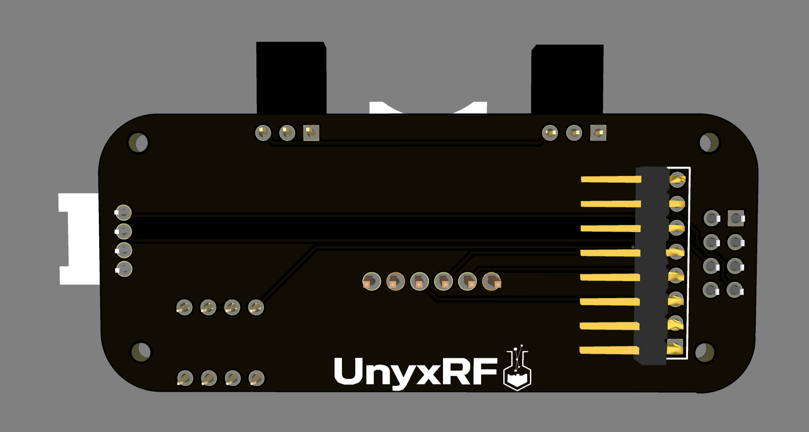
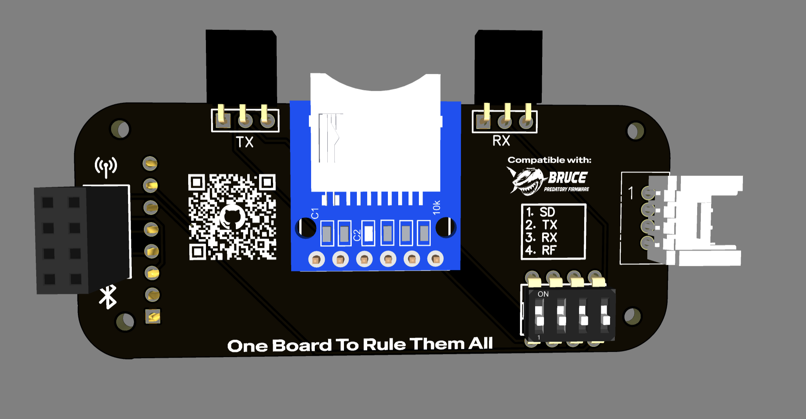

# UnyxRF PCB

**UnyxRF** is an open-source PCB designed for the **M5StickC Plus 2**, allowing direct connection of multiple external modules via a **1×8 pin header** and a **Grove port**.
The aim of this project is to provide a **compact**, **flexible**, and **easy-to-build** board for RF and storage development.
It is fully compatible with [Bruce](https://github.com/pr3y/Bruce), expanding its use cases for open-source projects.

A big thanks to [sleepymorph](https://github.com/sleepymorph) for fixing all schematic issues!
I’ve redesigned the board so it can be **easily soldered at home** without specialized equipment.
The second production batch is currently on order.

  
  

---

## Features

* **M5StickC Plus 2** or **M5StickC Plus** compatible
* Works with **[Bruce](https://github.com/pr3y/Bruce)**
* Supports multiple modules:

  * **NRF24** or **CC1101**
  * **MicroSD Card Reader**
  * **IR Transmitter & Receiver**
* Compact design with direct module integration
* **DIY-friendly** – easy to solder at home
* Designed in [EasyEDA](https://www.easyeda.com)
* Planned manufacturing via [PCBWay](https://www.pcbway.com)

---

## Ordering Options

This is an **open-source project**, so you can:

1. **Order directly from [PCBWay](https://www.pcbway.com)**

   * Minimum order: **5 PCBs** (\~5 USD total)
   * Assembly service: **\~30 USD extra** if you can’t solder yourself

2. **Buy from me**

   * If you prefer a ready-to-use or pre-assembled board, you can DM me.
   * Availability depends on my stock – I can ship directly if I have units ready.

3. **DIY Build**

   * If you can solder, you can save money by ordering the parts yourself.
   * I’ve prepared a [parts list CSV](./Aliexpress-Parts.csv) with direct AliExpress links for convenience.

---

## Contributing

You can help improve the project by:

* Testing the board and reporting any issues
* Suggesting schematic or layout improvements
* Sharing your integration results

📌 **Use the Discussion tab** for general questions or ideas

🐞 **Use the Issues tab** only for bugs and design problems

Join the community here:
👉 [HackLab Discord Server](https://discord.gg/R8QJKCFYr9)

---

## License

This PCB design is licensed under the  
[Creative Commons Attribution-NonCommercial-ShareAlike 4.0 International (CC BY-NC-SA 4.0)](https://creativecommons.org/licenses/by-nc-sa/4.0/).

You are free to use, modify, and share this design **for personal and educational purposes only**.  
**Commercial use, resale, or distribution for profit is strictly prohibited.**

